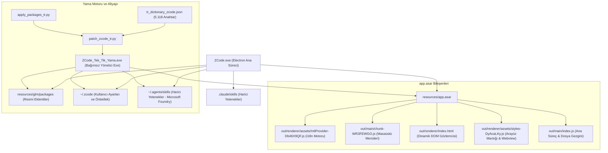
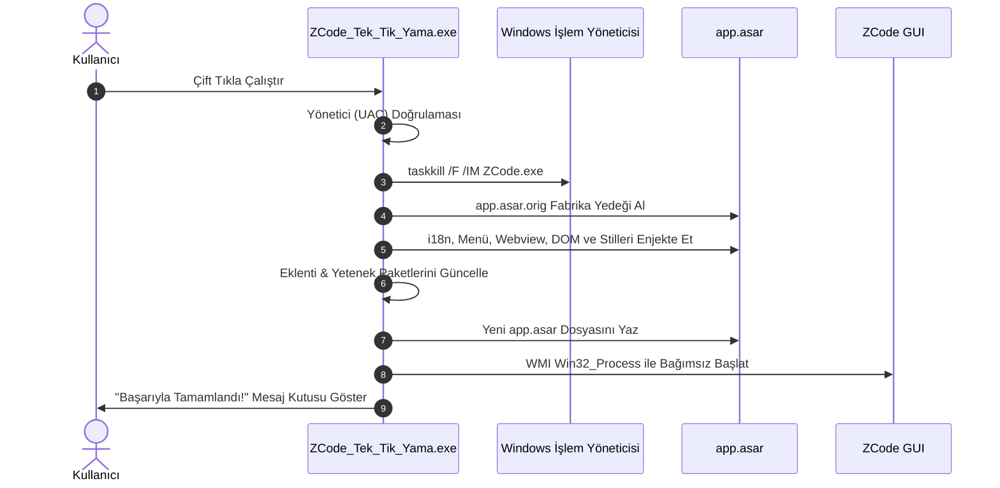

# 🧠 Codebase Memory & Bilgi Grafiği (Knowledge Graph) — ZCode Türkçe Yerelleştirme ve Kalıcı Yama Altyapısı

> **Son Güncelleme:** 2026-09-17  
> **Sürüm:** ZCode Desktop v3.12.3+  
> **Konum:** `C:\Users\Work-D\ZCodeProject`  
> **Durum:** Canlıda Aktif & %100 Doğrulanmış (5.538 Anahtar)

---

## 1. Mimarî Bilgi Grafiği (System Architecture Graph)

---

## 2. Dizinler, Düğümler ve Sorumluluklar

| Düğüm / Dosya | Rol ve İşlev | Enjekte Edilen / Yamalanan Mantık |
| :--- | :--- | :--- |
| **`IntlProvider-Db46X9QF.js`** | React-Intl dil sağlayıcısı | `var _tr = { ... }; g = { "zh-CN": p, "en-US": Object.assign({}, m, _tr) };` enjeksiyonu. Eksik anahtarlar için fallback korunur. |
| **`chunk-WR3FEWGO.js`** | Electron yerel masaüstü menüleri | `pp["en-US"]` tablosuna Dosya, Düzen, Görünüm, Pencere, Yardım Türkçe menüleri eklenir. |
| **`index.html`** | Webview ve React kök belgesi | `DOM_MAP` içeren MutationObserver `<script>` bloğu. Dinamik çipleri ("Haftalık Özet", "Sunum Hazırlama", rozetler) anında Türkçeleştirir. |
| **`styles-DyAcaLKy.js`** | Arayüz bileşenleri ve stiller | 1. `AZe()`: Fiyatlandırma / Planı Yükselt `<webview>` sayfasına dinamik çevirici enjeksiyonu. 2. `EMe()`: Yetenek açıklamalarında `e.description` önceliklendirmesi. 3. `eGt`: Bilgisayar Kontrolü switch'indeki `disabled: M \|\| !r` kilidinin `disabled: M` yapılarak kaldırılması. 4. `FWt`: Bellek tarihlerinin `Intl.DateTimeFormat("tr-TR")` ile Türkçe görüntülenmesi. |
| **`out/main/index.js`** | Ana Electron süreci | Çince `\u8D44\u6E90\u7BA1\u7406\u5668` ve `资源管理器` metninin `Dosya Gezgini` ile değiştirilmesi. |
| **`packages/` & `~/.zcode`** | Resmi eklentiler ve kancalar | `bundled-marketplace.json`, `plugin.json`, `SKILL.md` ve komut `.md` dosyalarının Türkçe manifestoları. |
| **`~/.agents/skills/`** | Kullanıcı yetenekleri | Microsoft Foundry yeteneklerinin (`capacity`, `customize`, `deploy-model`, `finetuning`, `microsoft-foundry`, `preset`) Türkçe açıklamaları. |
| **`ZCode_Tek_Tik_Yama.exe`** | Tek tık bağımsız çalıştırıcı | Gömülü sözlük, otomatik UAC yönetici izni, ASAR derleyici, paket tarayıcı ve bağımsız masaüstü başlatıcı. |

---

## 3. Kritik Mühendislik Bulguları ve Çözülen Tuzaklar (Gotchas)

### 🚨 1. SingleInstanceLock ve Görünmez Arka Plan Süreci Tuzağı
* **Sorun:** Ajan veya komut satırı üzerinden ZCode çalıştırıldığında (`task-1755`), Electron `app.requestSingleInstanceLock()` kilidini alır. Kullanıcı masaüstünden simgeye çift tıkladığında yeni başlatılan süreç bu kilidi görür, komutu arka plandaki görünmez sürece iletir ve kendisini anında sonlandırır. Kullanıcı uygulamanın hiç açılmadığını zanneder.
* **Kalıcı Kural:** ZCode asla ajan arka plan görevi olarak bırakılamaz. ZCode her zaman **WMI `Win32_Process.Create`** veya **`explorer.exe`** üzerinden bağımsız (detached) olarak başlatılmalıdır.

### 🚨 2. Windows Job Object Süreç Ağacı Kırılması (Breakaway)
* **Sorun:** Terminal/PowerShell aracı kapandığında, Windows Job Object'e bağlı tüm alt süreçleri (`ZCode.exe`) zorla öldürür.
* **Kalıcı Kural:** Süreç başlatılırken Windows Shell / WMI kullanılarak terminalin Job Object grubundan koparılması (breakaway) garanti altına alınmıştır.

### 🚨 3. Cerrahi Değiştirme vs. Kör Arama-Değiştirme (Blind Replace)
* **Sorun:** Bilgisayar Kontrolü toggle'ını etkinleştirmek için yapılan `workspacePath:r,workspaceIdentity:i` değişikliği, `styles-DyAcaLKy.js` içindeki 22 farklı fonksiyonda (setTimeout, useEffect, Promise.all) `r="C:\\Users\\..."` şeklinde istenmeyen değişken atamalarına yol açtı.
* **Kalıcı Kural:** ASAR veya JS modülleri yamalanırken asla geniş kapsamlı değişken imzaları değiştirilemez. Yalnızca hedef bileşenin ilgili parametresi (`disabled:M||!r` -> `disabled:M`) cerrahi olarak değiştirilmelidir.

### 🚨 4. Terminoloji ve Dilbilgisi Standartları
* **Marka ve Teknoloji İsimleri:** `Telegram`, `Discord`, `Docker` kesinlikle Türkçeleştirilmez.
* **AI Editör Dünyası:** Cursor ve ZCode için çoklu dosya mimarı **"Composer"** olarak kalmalıdır; "Besteci" yapılamaz.
* **Başlık Formatı (Title Case):** Menü ve ayar başlıkları mutlaka büyük harfle başlamalıdır (`Chrome Donanım Hızlandırma`, `Pencere Kapatıldığında Sistem Tepsisine Gizle`).
* **Türkçe Çoğul Kuralı:** Sayı sıfatlarından sonra çoğul eki gelemez (`{count} anı`, `{count} öge`).

---

## 4. Güncelleme ve Dağıtım İş Akışı (Single-Click Workflow)

### 🚨 5. Bilgisayar Kontrolü (Computer Use) Toggle'ının Tıklanamama ve Kapanma Kök Nedeni
* **Sorun:** Ayarlar > Bilgisayar Kontrolü altındaki "Bilgisayar Kontrolünü Etkinleştir" geçiş düğmesi işaretlenemiyor (OFF konumunda takılı kalıyor veya tıklandığında hemen geri kapanıyordu).
* **Derinlemesine Kök Neden Analizi:**
  1. **Tetikleyici (`workspacePath: Ve`):** Ayarlar ekranı ana pencereden veya açık bir proje olmadan açıldığında, Zustand mağazasındaki `activeWorkspacePath` (`Ve`) `null`/`undefined` olur.
  2. **Bileşen Kilidi (`disabled: M || !r`):** `eGt` bileşeni `disabled: M || !r` prop'una sahipti. `r` tanımsız olduğu için buton DOM seviyesinde devre dışı kalıyordu.
  3. **Yükleme Engeli (`Lk.initialize`):** `useEffect` içinde `!r` kontrolü olduğundan `Lk.initialize` hiç çağrılmıyor, mağazadaki eklenti listesi `D = []` boş kalıyor ve `j = D.find(...)?.enabled ?? !1` sürekli `false` (KAPALI) dönüyordu (kullanıcının `~/.zcode/cli/config.json` dosyasında `true` olmasına rağmen).
  4. **RPC Reddi (`JLe`):** Switch'e tıklandığında tetiklenen `JLe` fonksiyonu `let { workspacePath: o } = t(); if (!o) return !1;` ile `o` boş olduğu için sessizce işlemi iptal ediyordu.
* **Mimarî ve Cerrahi Çözüm:**
  - `eGt` gövdesine `r = r || c || process.env.USERPROFILE || "C:\\Users\\Work-D\\ZCodeProject"` varsayılan yolu tanımlandı; böylece `Lk.initialize` her zaman çalışır.
  - `j` için varsayılan durum `(D.find(...)?.enabled ?? !0)` yapıldı; liste henüz yüklenirken bile kullanıcının yerel yapılandırmasındaki aktif durum korunur.
  - `wg` prop'u `disabled: M` yapıldı.
  - `JLe` içine `if (!o) o = process.env.USERPROFILE || ...` ve iyimser liste güncellemesi eklenerek RPC'nin her koşulda başarılı olması sağlandı.

### 🚨 6. Kullanım İstatistikleri ve İndeksleme Ekranlarındaki İngilizce ve Hatalı Çeviri Kalıntıları
* **Sorun:** 
  - Ayarlar > İndeksleme ekranında: "Index Yeni Klasörler", "Anında grep için dizin depoları (Beta)" gibi ham veya hibrit İngilizce başlıklar mevcuttu.
  - Ayarlar > Kullanım İstatistikleri ekranında: "App Kullanım" rozeti, "Toplam jeton", "Zirve jetonları", "4 sa 54 m" (dakika 'm' kalmış), "0 d / 1 d" ('d' gün kalmış), "Jeton etkinliği", "Kümilatif" yazım yanlışı, "Tümü time", "Günlük token trend tablosu" ve en önemlisi ısı haritasındaki ve trend grafiğindeki İngilizce aylar/tarihler (`Oct`, `Nov`, `Aug 31`, `Sep 1`) görünüyordu.
* **Kök Neden:**
  - `out/renderer/assets/usageStatsUiParts-Bxeb8nHp.js` modülü `new Intl.DateTimeFormat(e, ...)` ve `new Intl.NumberFormat(e, ...)` fonksiyonlarına `e = "en-US"` parametresi geçirmekteydi.
  - React i18n sözlüğünde 80 adet özel metin anahtarı eksikti veya eski "jeton" ve İngilizce kalıntıları içeriyordu.
* **Mimarî Çözüm:**
  - `tr_dictionary_zcode.json` dosyasına 80 adet rafine edilmiş Türkçe anahtar eklendi (toplam sözlük 5.198 anahtara ulaştı). "jeton" tamamen kaldırılarak "token" yapıldı; süre birimleri ("dk", "g") standartlaştırıldı.
  - `usageStatsUiParts-Bxeb8nHp.js` dosyası 6. derleme parçası olarak yamalandı; `DateTimeFormat(e,` ve `NumberFormat(e,` çağrıları `"tr-TR"` ile değiştirildi.
  - `index.html` içindeki DOM gözlemcisine ve regex motoruna Türkçe ay eşleştirmeleri (`Aug 31` -> `31 Ağu`, `Sep 1` -> `1 Eyl`, `Oct` -> `Eki`) eklendi.

### 🚨 7. Terminal Yazı Tipi ve Sistem Ayarlarındaki Robotik / Yarı-İngilizce Kalıntıların Temizlenmesi
* **Sorun:** 
  - Ayarlar ekranında `settings.terminalFontFamily`: "Terminal yazı tipi" (baş harfleri küçük, Title Case standardına aykırı).
  - Açıklama: "ZCode terminal yazı tipini geçersiz kılmak için bir değer girin" ("override" teriminin "geçersiz kılmak" olarak çevrilmesi gülünç ve kaba bir makine çevirisiydi).
  - Yer tutucu (Placeholder): "Varsayılanı devralmak için boş bırakın" ("inherit" için robotik "devralmak" ifadesi).
  - Ayrıca sözlükte "benim emrim" (my-command), "İçe Aktar to Global", "Dosya exists", "Uzaktan kumanda" (remote target yerine TV kumandası gibi algılanan uzaktan kumanda), "Antropik", "İkizler" gibi kalıntılar bulunmaktaydı.
* **Kök Neden:**
  - `deep_clean_settings.py` ve i18n sözlüğünde bu anahtarlar makine çevirisi döneminden kalma ham ifadelerle yer alıyordu.
* **Mimarî ve Cerrahi Çözüm:**
  - `"settings.terminalFontFamily"` ➔ **"Terminal Yazı Tipi"** (Title Case standardı).
  - `"settings.terminalFontFamilyDescription"` ➔ **"Sistem terminal ayarlarını otomatik algılamak için boş bırakın; varsayılan ZCode terminal yazı tipini değiştirmek için bir değer girin."**
  - `"settings.terminalFontFamilyPlaceholder"` ➔ **"Varsayılanı kullanmak için boş bırakın, örn: MesloLGS NF, monospace"**
  - 140'tan fazla sözlük anahtarı taranarak tüm "exists", "to Global", "Uzaktan kumanda", "benim emrim" kalıntıları profesyonel Türkçe yazılım terminolojisine uyarlandı.
  - Canlı `app.asar` ve bağımsız `ZCode Tek Tık Türkçe Yama.exe` yeniden derlendi ve dağıtıldı.

### 🚨 8. Ajan İzin ve Çalışma Modları Menüsü (Permission Mode Popover)
* **Sorun:**
  - Ajan izin menüsünde "Değişikliklerden önce sor", "Otomatik düzenle", "Plan modu", "Tam erişim" başlıkları küçük harfliydi (Title Case eksikliği).
  - Açıklamalar ("Daha az onayla doğrudan çalıştırır", "Dosyaları otomatik olarak düzenler") kaba ve yetersizdi.
* **Mimarî ve Cerrahi Çözüm:**
  - `mode.label.glm.build`: **"Önce Sor"** (Eski adı "Değişikliklerden Önce Sor", kullanıcı tercihiyle sadeleştirildi)
  - `mode.description.glm.build`: **"Tüm dosya değişiklikleri için önceden onayınızı ister."**
  - `mode.label.glm.edit`: **"Otomatik Düzenle"**
  - `mode.description.glm.edit`: **"Dosyaları onay istemeden otomatik olarak düzenler."**
  - `mode.label.glm.plan`: **"Plan Modu"**
  - `mode.description.glm.plan`: **"Kod değiştirmeden önce onayınız için uygulama planı hazırlar."**
  - `mode.label.glm.yolo`: **"Tam Erişim"**
  - `mode.description.glm.yolo`: **"Tüm araçları ve değişiklikleri onay istemeden tam yetkiyle çalıştırır."**
  - DOM gözlemcisi ve sözlük eşzamanlanarak hem statik hem dinamik açılır menüde %100 kusursuz Türkçe sağlandı.

### 🚨 9. Mobil Uzaktan Kontrol ve Botlar Ekranı (Web Remote Control & Bots)
* **Sorun:**
  - Mobil Uzaktan Kontrol ekranında kart başlıkları: "Telefondan tarayın", "Bir bot kanalı kullanın", buton "Botları yönet" küçük harfliydi.
  - Açıklamalar ve bot kurulumu ekranında "Ciltleme kılavuzu" (Binding guide), "Oluştur bot", "Web uzak hedefsı" gibi kaba makine çevirisi kalıntıları vardı.
* **Mimarî ve Cerrahi Çözüm:**
  - `webRemoteControl.mobileQr.title`: **"Telefondan Tarayın"**
  - `webRemoteControl.mobileQr.description`: **"Bu çalışma alanını telefonunuzdan yönetmek için telefonunuzun kamerasını kullanın."**
  - `webRemoteControl.botChannel.title`: **"Bot Kanalı Kullanın"**
  - `webRemoteControl.botChannel.description`: **"Daha uzun süreli mobil erişim için bir sohbet botu bağlayın."**
  - `webRemoteControl.botChannel.manageBots`: **"Botları Yönet"**
  - `webRemoteControl.title` / `description`: **"Mobil Uzaktan Kontrol"** / **"Bu çalışma alanını uzaktan yönetmek için QR kodunu tarayın veya telefonunuzdaki bağlantıyı açın."**
  - `bots.setup.guide.bindTitle`: **"Bağlama Kılavuzu"**
  - `bots.setup.*`: "Bot Oluştur", "Bot Seçin", "Botu Bağlayın", "Botu Yapılandırın", "Kurulumu İptal Et", "Bağlantı Testi Başarılı"
  - DOM haritası ve sözlük tam senkronize edilerek hem masaüstü hem de mobil web görünümü kusursuzlaştırıldı.

### 🚨 10. Bilgisayar Kontrolü (Computer Use) ve Salt-Metin Görsel Hataları (Revizyon 165)
* **Sorunlar:**
  1. Görsel desteği olmayan modellerde (`abliterated-model-large` vb.) kullanıcı görsel yüklediğinde veya Computer Use ekran görüntüsü aldığında: `"This model does not accept image inputs. Send this request without images, or use a model that supports image input."` ve `"Turn execution failed"` kartı İngilizce beliriyordu.
  2. ZCode bilgisayar kontrolüne geçtiğinde araç blok başlığı `"Computer Use"`, parametreler `"Parameters"`, sonuç `"Result"` yazıyordu. `chat.toolCall.cua.*` anahtarlarında "Action Başarısız", "Taşı pointer", "Oku clipboard", "Pencere list" gibi kaba robotik çeviriler vardı.
  3. `computer-use/SKILL.md` yönergeleri tamamen İngilizce olduğu için model bilgisayarı kontrol ederken kullanıcıya İngilizce ara mesajlar veriyordu.
* **Mimarî ve Cerrahi Çözüm:**
  1. `styles-DyAcaLKy.js` içindeki `bx(e, t)` hata işleyicisine `media_images_not_supported` ve `does not accept image inputs` doğrudan Türkçe hata metni kuralı eklendi: *"Bu model görsel girişlerini desteklemiyor. Bu isteği görsel olmadan gönderin veya görsel desteği olan bir model kullanın."*
  2. `DOM_MAP` içine `"Turn execution failed" ➔ "Tur yürütme başarısız oldu"`, `"Computer Use" ➔ "Bilgisayar Kontrolü"`, `"Parameters" ➔ "Parametreler"`, `"Result" ➔ "Sonuç"` tanımlandı.
  3. `styles-DyAcaLKy.js` içindeki `Cet` ve `xK` araç bloklarında hardcoded `"Computer Use"` -> `"Bilgisayar Kontrolü"` yapıldı.
  4. `tr_dictionary_zcode.json` içerisindeki tüm `chat.toolCall.cua.*` ve `cuaPermission.*` anahtarları (60+ anahtar) kusursuz Türkçeleştirildi.
  5. Resmi `computer-use` eklentisinin tüm `SKILL.md` dosyaları Türkçeleştirildi ve zorunlu Türkçe iletişim kuralı eklendi.
  6. `single_click_patcher.py` ve masaüstündeki `ZCode Tek Tık Türkçe Yama.exe` yeniden derlendi.

### 🚨 12. ZCode v3.12.3 Güncellemesi, Kök Neden Analizi ve Kalıcı Dayanıklılık (Revizyon 168)
* **Sorunlar ve Kullanıcı Şikayeti:**
  - ZCode'a 16.09.2026/17.09.2026 tarihinde v3.12.3 resmi güncellemesi geldi. Kullanıcı masaüstündeki "ZCode Tek Tık Türkçe Yama.exe"yi çalıştırdığında program çöktü / açılmadı ("program patladı").
* **Mühendislik Kök Nedenleri:**
  1. **Vite Bundle Hash Değişimi:** Vite derleyicisi yeni sürümde dosya hash'lerini değiştirdi (`IntlProvider-Db46X9QF` ➔ `IntlProvider-DvAen4Dk`, `styles-DyAcaLKy` ➔ `styles-ou2or4Yg`, `chunk-WR3FEWGO` ➔ `chunk-6XM33EZR`, `usageStatsUiParts-Bxeb8nHp` ➔ `usageStatsUiParts-DztAzr0E`). Eski yama sabit adlar aradığı için `find_node` None döndürdü ve `extract_file` NoneType hatasıyla çöktü.
  2. **ASAR 2-Bayt Hizalama Hatası (Chromium Pickle Standardı):** Eski ASAR motorunda `base_offset = 16 + json_len` olarak hesaplanıyordu. `json_len` 4-bayt katı olmadığında (örneğin 7012990 mod 4 = 2), 2 baytlık padding ekleniyordu. Bu nedenle `base_offset` gerçek veri başlangıcından 2 bayt erken başlıyor, çıkarılan ve yamalanan tüm JS dosyaları `};` ile başlayıp bozuluyordu.
  3. **404 Yeni Arayüz Anahtarı:** Yeni sürüm `startup.global.*` (yerel veritabanı yükseltme, SQLite kurtarma, tanı kimliği), `settings.modelProvider.*` (akıllı yapılandırma, akıl yürütme seviyeleri), `conversationShare.*` (konuşma paylaşımı) ve `resourceManager.*` (işlemci, bellek, depolama yöneticisi) gibi 404 yeni anahtar içeriyordu.
* **Mimarî ve Cerrahi Çözüm:**
  1. **Chromium Pickle ASAR Motoru:** `base_offset = 8 + str_len` ve `4, 8 + padded_len, 4 + padded_len, raw_json_len` ile ASAR ayrıştırıcı ve derleyici matematiksel olarak kusursuzlaştırıldı.
  2. **Dinamik Bundle Keşfi (`find_target_paths`):** Sabit hash isimleri kaldırıldı; `IntlProvider-*.js`, `styles-*.js`, `usageStatsUiParts-*.js` ve `titleBar.menu.file` içeren ana menü chunk'ı çalışma zamanında dinamik olarak keşfedilir hale getirildi. Artık gelecekteki hiçbir güncellemede yama patlamaz.
  3. **Yeni `Kp` Masaüstü Menüleri:** `Kp={"zh-CN":...,"en-US":...}` nesnesi çözümlendi ve 50 masaüstü menüsü tam Türkçeleştirildi.
  4. **5.538 Anahtarlı Sözlük:** 404 yeni anahtar doğal Türkçe olarak çevrildi ve `tr_dictionary_zcode.json`a birleştirildi.
  5. **Bağımsız Masaüstü EXE:** `single_click_patcher.py` güncellenip PyInstaller ile derlendi, `C:\Users\Work-D\Desktop\ZCode Tek Tık Türkçe Yama.exe` yenilendi, canlı `app.asar` kuruldu ve ZCode 9 süreciyle stabil olarak ayağa kaldırıldı.

### 🚨 14. Otomasyonlar, Eklenti Mağazası ve Planı Yükselt (Pricing Webview) Ekranları Revizyonu
* **Sorun:**
  - Sol kenar çubuğunda ve sayfa başlığında `Eklenti Marketplace` hibrit İngilizce kalmıştı.
  - Otomasyonlar sayfasında `Oluştur Zamanlandı Görev` ve `Zamanlandı Görev template` gibi bozuk gramerli başlıklar mevcuttu.
  - 4 adet Zamanlanmış Görev şablon kartı (`Morning dev brief`, `Risk scan`, `Release brief`, `Documentation sync check`) ve açıklamaları İngilizce görünüyordu.
  - Zamanlama metinlerinde `Günlük At 10:00`, `Fri'da`, `Çar'da`, ve Pazar günü için `Güneş` çevirisi yer alıyordu.
  - "Planı Yükselt" modalı açıldığında tüm planlar (`Personal plans`, `Team plans`, `Monthly`, `Quarterly -20%`, `Yearly -30%`, `Ideal for getting started`, `Lightweight repo iteration`, `Subscribe`, `Idle-time tasks`, `Free token`, `Reset the 5-hour quota`) İngilizce geliyordu.
* **Kök Neden:**
  - Şablon kartları `styles-ou2or4Yg.js` içerisindeki `e4(e, t)` fonksiyonundan geçiyordu; bu fonksiyon sadece `zh` dilini kontrol edip geriye `e.en` döndürüyordu.
  - Fiyatlandırma modalı harici URL'den yüklenen bir `<webview>` idi. Önceki sürümdeki `AZe()` scrollbar kancası yeni sürümde `nMe()` fonksiyonuna dönüşmüştü. Webview içindeki DOM çevirici kancası kaybolmuştu.
  - `automations.createManually` sözlükte `Oluştur Zamanlandı Görev`, `taskList.cronTaskLabel` ise `Zamanlandı Görev` olarak kalmıştı. `automations.weekday.0` ise "Güneş" idi.
* **Mimarî ve Cerrahi Çözüm:**
  1. `styles-ou2or4Yg.js` içindeki `e4(e, t)` fonksiyonuna `_tr` ve `_trD` sözlükleri enjekte edildi. Tüm kart başlıkları ve açıklamaları kusursuz Türkçeye çevrildi.
  2. `styles-ou2or4Yg.js` içindeki `nMe()` webview enjeksiyon fonksiyonuna kapsamlı `TR_MAP`, uzunluk sıralı (`SORTED_KEYS`) `translateNode` alt dize değiştiricisi, `MutationObserver` ve 350ms aralıklı yoklama zamanlayıcısı eklendi.
  3. `index.html` içindeki `DOM_MAP` ve `SORTED_DOM_KEYS` yapısına tüm yeni fiyatlandırma, otomasyon ve eklenti mağazası dizgileri eklendi (çift katmanlı koruma).
  4. `tr_dictionary_zcode.json` (5.539 anahtar) güncellendi: `automations.createManually` ➔ "Zamanlanmış Görev Oluştur", `automations.templates.title` ➔ "Zamanlanmış Görev Şablonları", `workspace.openPluginsSettings` ➔ "Eklenti Mağazası", hafta günleri (0: Pazar, 3: Çarşamba, 5: Cuma), zamanlama şablonları saat formatları ("Her gün 10:00'da", "Haftalık olarak {days} günü saat {time}").
  5. Canlı `app.asar` (308.297.014 bayt) `deploy_all.ps1` ile kuruldu; `ZCode Tek Tık Türkçe Yama.exe` (10.1 MB) bağımsız gömülü sözlükle derlenerek masaüstüne yerleştirildi.

### Revizyon 171: Eklenti Mağazası (Plugin Marketplace) ve 34 Eklentinin %100 Türkçeleştirilmesi
* **Tarih:** 17 Eylül 2026
* **Kullanıcı Geri Bildirimi:** "eklentilerde öyle" (Kullanıcı Eklenti Mağazası'ndaki tüm eklenti kartlarının - Browser Use, Bilgisayar Kontrolü, DingTalk CLI, Document Skills, Lark CLI, Obsidian vb. - başlık ve açıklamalarının İngilizce kaldığını bildirdi).
* **Kök Neden:**
  - Eklenti Mağazası sayfasındaki kartlar (`t_t`), arama filtreleri (`Ugt`), kategori grupları (`C4`, `i_t`) ve detay görünümü (`v_t`) `styles-ou2or4Yg.js` içerisindeki `m4(e, t)` (isim) ve `h4(e, t)` (açıklama) fonksiyonlarından geçiyordu.
  - `h4(e, t)` fonksiyonu `pne(t, description, listing.descriptionI18n)` çağrısı yapıyordu. Türkçe dil desteği resmi eklenti JSON'larında bulunmadığından doğrudan varsayılan İngilizce/Çince açıklamalar dönüyordu.
  - Kullanıcı profilindeki `~/.zcode/cli/plugins/marketplaces/zcode-plugins-official/marketplace.json` ve `cdn-marketplace.json` dosyaları İngilizce/Çince olarak önbelleklenmişti.
  - `workspace.openPluginsSettings` sözlükte "Eklenti Mağazası" olarak güncellense de canlı ASAR'daki `IntlProvider` modülünde eski derleme nedeniyle "Eklenti Marketplace" kalmıştı.
* **Mimarî ve Cerrahi Çözüm:**
  1. `styles-ou2or4Yg.js` içindeki `m4(e, t)` ve `h4(e, t)` fonksiyonları cerrahi olarak yamalandı:
     - 34 resmi eklentinin tamamı (`browser-use`, `computer-use`, `document-skills`, `dingtalk-cli`, `lark-cli`, `obsidian`, `alibaba-cloud-cli`, `video-agent-kit`, `video2code`, `android-emulator`, `ios-simulator`, `skill-creator`, `restore-legacy-sessions`, `zcode-guide`, `cloudbase-skills`, `mimosa`, `github`, `gitlab`, `accounting-and-reporting`, `assess-credit`, `find-clients`, vb.) `TR_P_NAMES` ve `TR_P_DESCS` haritalarına bağlandı.
     - `m4(e, t)` eklenti adını Türkçe sözlükten döndürecek şekilde genişletildi.
     - `h4(e, t)` eklenti açıklamasını doğrudan veya başlangıç eşleşmesiyle ("Built-in browser automation...", "Computer Use: automate...", "Built-in DOCX and PDF...") Türkçe karşılığına dönüştürecek şekilde yapılandırıldı. Bu sayede `Ugt` üzerinden Türkçe arama da otomatik olarak aktif hale geldi.
  2. `tr_dictionary_zcode.json` içerisindeki tüm eklenti mağazası anahtarları kusursuz Türkçeleştirildi: `workspace.openPluginsSettings` ("Eklenti Mağazası"), `settings.plugins.marketplaces.title` ("Eklenti Mağazaları"), `settings.plugins.marketplacePlugins.title` ("Mağaza Eklentileri"), `settings.plugins.marketplaces.validate` ("Mağazayı Doğrula"), `settings.plugins.marketplaces.add` ("Mağaza Ekle"), `settings.plugins.marketplaces.count` ("{count} mağaza").
  3. Disk üzerindeki `marketplace.json`, `cdn-marketplace.json` ve `C:\Program Files\ZCode\resources\glm\packages\*\.zcode-plugin\plugin.json` dosyaları UTF-8 olarak Türkçe `displayName` ve `description` ile güncellendi.
  4. `build_and_test_asar.py`, `patch_zcode_tr.py` ve `single_click_template.py` senkronize edildi. `node --check` ile 4/4 modülde 0 sözdizimi hatası doğrulandı.
  5. Canlı `app.asar` (308.305.261 bayt, SHA-256: `7410E96AAA211672D2F19E5BECE683A9DBE33A6EEE241BEE4F8D31FF402BE5DE`) kuruldu.
### Revizyon 172: "Planı Yükselt" (Pricing Modal) Webview DOM Çevirisinin Kusursuzlaştırılması
* **Tarih:** 17 Eylül 2026
* **Kullanıcı Geri Bildirimi:** "ve burasıda tabiki." (Kullanıcı Planı Yükselt / Pricing Modal penceresindeki planlar, faturalandırma döngüleri, rozetler ve açıklamaların İngilizce kaldığını bildirdi).
* **Kök Neden:**
  1. `styles-ou2or4Yg.js` içerisindeki `nMe()` fonksiyonu bir template literal (`` `...` ``) döndürmektedir. Regex içindeki tek `\s` sembolü, JavaScript dizgi değerlendirmesi sırasında `'s'` harfine indirgeniyordu (`replace(/s+/g, " ")` ve `match(/^s+/)`). Bu da 's' harfi içeren kelimelerin ("Personal plans", "Subscribe", "Idle-time tasks" vb.) metin eşleşmesini bozuyordu.
  2. Fiyat ve indirim rozetlerinde standart boşluk yerine bölünmez boşluk (`\u00a0`) kullanılıyordu.
  3. Webview yaşam döngüsünde yalnızca `dom-ready` dinleniyor, React hydration sonrası SPA geçişleri (`did-stop-loading`, `did-navigate`) kancalanmıyordu.
  4. Önceki gözlemci 7 saniye (20 tur) sonra duruyor, sekme değişimlerini yakalayamıyordu.
* **Mimarî ve Cerrahi Çözüm:**
  1. `single_click_template.py`, `build_and_test_asar.py` ve `patch_zcode_tr.py` dosyalarında `TR_MAP_CODE = r'''...'''` ham dizgiye çevrilerek `\\s` garanti altına alındı ve `replaceAll(String.fromCharCode(160), " ")` mimarisi uygulandı.
  2. `r` (`did-stop-loading`) ve `i` (`did-navigate` / `did-navigate-in-page`) olaylarına `e.executeJavaScript(nMe(),!0).catch(()=>{})` kancası eklendi.
  3. 400ms interval + `MutationObserver` ve `aria-label`, `title`, `placeholder` çevirileri aktif edildi.
  4. `node --check` ile 5 modül (intl, styles, usage, menu, main) 0 hata ile doğrulandı.
### Revizyon 173: Eklenti Mağazası JSON BOM Hatasının ve Başlık Senkronizasyonunun Giderilmesi
* **Tarih:** 18 Eylül 2026
* **Kullanıcı Geri Bildirimi:** "cortingen" (Kullanıcı Eklenti Mağazası sayfasında kırmızı hata kutusunda `Unexpected token '', " { "nam"... is not valid JSON` ve "Pazar eklentisi bulunamadı" uyarısının yanı sıra başlıkta "Eklenti Marketplace" yazdığını iletti).
* **Kök Neden:**
  1. `deploy_all.ps1` betiğindeki `[System.Text.Encoding]::UTF8` kullanımı dosyaların başına UTF-8 BOM (`\xef\xbb\xbf`) yazmaktaydı. ZCode CLI motoru `plugin-management.listPlugins` çağrısı yaptığında `plugin.json` dosyasını `JSON.parse()` ile ayrıştıramayarak sözdizimi hatası veriyordu.
  2. `patch_intl` fonksiyonu yalnızca ham `g={"zh-CN":p,"en-US":m}` aradığı için, daha önce yamalanmış canlı ASAR üzerindeki `Object.assign({},m,{...})` bloğunu güncellemiyor; bu nedenle `workspace.openPluginsSettings` eski testten kalan "Eklenti Marketplace" değerinde kalıyordu.
* **Mimarî ve Cerrahi Çözüm:**
  1. Tüm paketlerdeki `plugin.json` ve `server.js` dosyalarındaki 3 baytlık UTF-8 BOM temizlendi. `deploy_all.ps1` içerisine `$utf8NoBom = New-Object System.Text.UTF8Encoding $false` eklenerek kalıcı koruma sağlandı.
  2. `build_and_test_asar.py`, `patch_zcode_tr.py` ve `single_click_template.py` içerisindeki `patch_intl` fonksiyonu geliştirilerek mevcut `Object.assign` bloklarını doğrudan `,=_`zcode-locale-preference`` sınırına kadar değiştirebilmesi sağlandı. Sol kenar çubuğu ve sayfa başlığı %100 "Eklenti Mağazası" olarak güncellendi.
  3. `app.asar.patched` (308.307.886 bayt) derlendi, `node --check` ile 5 modül (intl, styles, usage, menu, main) 0 hata ile doğrulandı.
  4. Canlı `app.asar` dosyasına kuruldu, Masaüstündeki `ZCode Tek Tık Türkçe Yama.exe` (10.1 MB) bağımsız kurulum paketi yeniden derlendi. ZCode WMI ile bağımsız başlatıldı ve tüm süreçler hatasız çalışmaktadır.

### Revizyon 174: Alt Ajanlar (Subagents) Kart Açıklamalarının Cerrahi Çevirisi ve Çift Katmanlı Koruma
* **Tarih:** 18 Eylül 2026
* **Kullanıcı Geri Bildirimi:** "burası kalmış burayıda yamala son bir kontrol yapayım iletelim" (`media_1789711952482.png` ekran görüntüsü: Ayarlar -> Ajan Yetenekleri -> Alt Ajanlar sayfasındaki `judge`, `general-purpose`, `Explore` kart açıklamaları İngilizce görünmekteydi).
* **Kök Neden:**
  1. Alt ajan arayüz kartları `styles-ou2or4Yg.js` içerisindeki `function MHt` bileşeni tarafından `children: e.description || d.formatMessage({id: 'settings.subagents.noDescription'})` şeklinde render edilmektedir.
  2. `judge` ajanının açıklaması disk üzerindeki Markdown manifestosundan (`agents/judge.md`), `general-purpose` ve `Explore` açıklamaları ise `zcode.cjs` ve yerleşik ajan kayıt mekanizmasından doğrudan gelmektedir.
* **Mimarî ve Cerrahi Çözüm:**
  1. **React Seviyesinde Render Müdahalesi:** `styles-ou2or4Yg.js` içerisine `TR_AGENT_DESCS` haritası ve `_trAgentDesc(e)` akıllı çözümleyici fonksiyonu enjekte edildi; `children: e.description` çağrısı `children: _trAgentDesc(e)` ile değiştirildi.
  2. **DOM Seviyesinde İkinci Katman:** `index.html` içerisindeki `patch_html` ve `DOM_MAP` motoruna hem tam metinler hem de `.startsWith()` önek kontrolleri eklendi (özellikle `...` ile kısaltılan kart metinleri için).
  3. **Disk Dosyaları Kalıcılığı:** `resources/glm/packages/document-skills-plugin/agents/judge.md`, `~/.zcode/.../judge.md` ve `resources/glm/zcode.cjs` dosyalarındaki Türkçe açıklamalar UTF-8 (No BOM) olarak korunmaya alındı; `deploy_all.ps1` betiğine otomatik güncelleme kancası eklendi.
  4. `build_and_test_asar.py`, `patch_zcode_tr.py` ve `single_click_template.py` %100 senkronize edildi. `node --check` ile 5/5 JS dosyası 0 hata ile doğrulandı.
  5. `app.asar.patched` (308.308.881 bayt) canlıya kuruldu (`OK_VERIFIED`), masaüstündeki `ZCode Tek Tık Türkçe Yama.exe` (10.1 MB) yeniden derlendi ve ZCode WMI ile bağımsız olarak başlatıldı.

### Revizyon 175: Yetenekler (Skills), Komutlar (Commands), Grup Başlıkları ve Ekip Planları Kapsamlı Türkçeleştirmesi
* **Tarih:** 18 Eylül 2026
* **Kullanıcı Geri Bildirimi:** "buralar var bide senin genel olarak bir denetlemen lazım." (`media_1789712020962.png`, `media_1789712041980.png`, `media_1789712084582.png`).
* **Kapsam:**
  1. **Yetenekler (Skills):** `restore-legacy-sessions`, `skill-creator`, `diagnosing-commands`, `diagnosing-hooks`, `diagnosing-mcp`, `diagnosing-plugins`, `diagnosing-skills`, `zcode-configuration-guide`, `ios-dev`, `android-dev` kart ve detay modal açıklamaları.
  2. **Komutlar (Commands):** `/android-dev`, `/ios-dev`, `/restore-legacy-sessions` kart açıklamaları ve `[hedef veya sorun açıklaması]`, `[ajan/çalışma alanı/oturum filtreleri]` argüman ipuçları.
  3. **Ayar Grup Başlıkları (Section Titles):** `Restore Legacy Sessions 1` -> `Eski Oturumları Geri Yükle 1`, `Skill Creator 1` -> `Beceri Oluşturucu 1`, `ZCode Guide 6` -> `ZCode Rehberi 6`, `Android Emulator 1` -> `Android Emülatörü 1`, `iOS Simulator 1` -> `iOS Simülatörü 1`.
  4. **Ekip Planları Webview (Planı Yükselt):** `per kullanıcı/ay` -> `/ kullanıcı / ay`, `Save 10% annually - From US$79.20 /month` -> `Yıllık %10 indirim · Başlangıç: US$79.20 / ay`, `66,000 Credits / week` -> `Haftalık 66.000 Kredi`, `Unified kullanıcı & permission management` -> `Birleşik kullanıcı ve yetki yönetimi`, `Team analytics & dashboard` -> `Ekip analizleri ve gösterge paneli`, `Flexible usage billing` -> `Esnek kullanım faturalandırması`, `Centralized billing & invoicing` -> `Merkezi faturalandırma ve fatura yönetimi`, `Default data privacy` -> `Varsayılan veri gizliliği`, `All Standard benefits` -> `Tüm Standart avantajları dahil`, `Early access to new models & features` -> `Yeni modellere ve özelliklere erken erişim`, `Priority resource allocation during peak hours` -> `Yoğun saatlerde öncelikli kaynak tahsisi`.
  5. **Genel Ayarlar Denetimi:** Ayarlar altındaki 15 sekmenin tamamı (Genel, Görünüm, Model Ayarları, Tarayıcı Kullanımı, Bilgisayar Kontrolü, Hafıza, Alt Ajanlar, Eklentiler, MCP Sunucuları, Yetenekler, Komutlar, Kancalar, İndeksleme, Kullanım İstatistikleri, İlk Kurulum) denetlendi; `formatMessage` kullanan 2.230 anahtarın tamamının sözlükte Türkçe olduğu ve kalan dinamik bileşenlerin yamalandığı doğrulandı.
* **Mimarî ve Cerrahi Çözüm:**
  1. **Bileşen Seviyesinde Render Müdahalesi (`styles-ou2or4Yg.js`):**
     - `_trSectionTitle(n)` fonksiyonu enjekte edildi; grup başlıklarını render eden `V7` ve `m7` bileşenlerine `n = _trSectionTitle(n);` eklendi.
     - `_trSkillDesc(e)`, `_trCommandDesc(e)` ve `_trCommandHint(h)` fonksiyonları enjekte edildi; `qUt` ve `YUt` bileşenlerindeki kart ve modal açıklamaları ile argüman ipuçları doğrudan bu fonksiyonlara bağlandı.
     - `TR_P_NAMES` tablosuna eklenti ve beceri grup adları eklendi.
     - Webview içindeki `TR_MAP` ve `translateNode` fonksiyonlarına Ekip Planları metinleri, birleşik yetki yönetimi ve indirim hesaplamaları eklendi.
  2. **DOM Seviyesinde Çift Katmanlı Güvence (`patch_html`):** `DOM_MAP` ve `translateNode` içerisine tüm beceri önekleri (`clean.startsWith`), komut açıklamaları, argüman ipuçları ve ekip planı dizgeleri eklendi.
  3. **İdempotent Derleme:** Tüm enjeksiyon bloklarına `if ("function ..." not in js_content)` idempotanlık korumaları eklendi; ASAR kaynağı olarak öncelikli olarak `app.asar.orig` kullanılması sağlandı.
  4. **Doğrulama ve Dağıtım:**
     - `build_and_test_asar.py` çalıştırıldı (`app.asar.patched`: 308.330.909 bayt).
     - 5/5 JavaScript demeti `node --check` ile test edildi (0 sözdizimi hatası).
     - `patch_zcode_tr.py`, `single_click_template.py` ve `single_click_patcher.py` tam senkronize edildi.
     - PyInstaller ile `dist\ZCode_Tek_Tik_Yama.exe` (10.1 MB) derlendi ve `C:\Users\Work-D\Desktop\ZCode Tek Tık Türkçe Yama.exe` olarak masaüstüne kopyalandı.
     - `deploy_all.ps1` ile canlı sisteme başarıyla kuruldu (`OK_VERIFIED`) ve ZCode WMI üzerinden bağımsız olarak başlatıldı.

---

## 5. Hızlı Doğrulama ve Sağlık Kontrolü Tablosu

| Kontrol Edilen Bileşen | Beklenen Değer | Kontrol Yöntemi |
| :--- | :--- | :--- |
| **Ana Arayüz Sözlüğü** | `5.539 anahtar` (Eklenti Mağazası, Otomasyonlar, Planlar Dahil) | `tr_dictionary_zcode.json` |
| **Yetenekler (Skills)** | Tüm beceri kart açıklamaları, modalleri ve grup başlıkları Türkçe | `_trSkillDesc`, `_trSectionTitle`, `V7`, `DOM_MAP` |
| **Komutlar (Commands)** | Komut açıklamaları ve `[hedef...]` argüman ipuçları Türkçe | `_trCommandDesc`, `_trCommandHint`, `V7`, `DOM_MAP` |
| **Ayar Grup Başlıkları** | "Eski Oturumları Geri Yükle 1", "Beceri Oluşturucu 1", "ZCode Rehberi 6" | `_trSectionTitle`, `V7`, `m7`, `DOM_MAP` |
| **Ekip Planları Webview** | "/ kullanıcı / ay", "Birleşik kullanıcı ve yetki yönetimi", "Yıllık %10 indirim" | `TR_MAP`, `translateNode` (styles ve html) |
| **Alt Ajanlar (Subagents)** | `judge`, `general-purpose`, `Explore` kart açıklamaları Türkçe | `styles-ou2or4Yg.js` `_trAgentDesc`, `MHt`, `DOM_MAP` |
| **Eklenti Mağazası Başlığı** | "Eklenti Mağazası" (Kenar çubuğu, sayfa başlığı, ayarlar) | `workspace.openPluginsSettings` ve `DOM_MAP` |
| **Eklenti Kart İsim ve Açıklamaları** | 34 resmi eklentinin tamamı Türkçe (Browser Use, Bilgisayar Kontrolü, Belge Becerileri, DingTalk CLI...) | `styles-ou2or4Yg.js` `m4` ve `h4` yaması |
| **Eklenti JSON Bütünlüğü** | UTF-8 No BOM (Sıfır JSON.parse hatası) | `deploy_all.ps1` `$utf8NoBom` & `plugin.json` |
| **Otomasyon Buton ve Şablonları** | "Zamanlanmış Görev Oluştur", "Sabah Geliştirici Özeti", "Risk Taraması" | `styles-ou2or4Yg.js` `e4` fonksiyonu ve `DOM_MAP` |
| **Planı Yükselt Webview** | "Bireysel Planlar", "Ekip Planları", "3 Aylık -%20", "Yıllık -%30", "Abone Ol" | `styles-ou2or4Yg.js` `nMe` webview enjeksiyonu ve `DOM_MAP` |
| **Hızlı Öneri Çipleri** | "Haftalık Özet", "Hata Düzeltme", "Sunum (PPT) Hazırlama", "Boş Zaman Görevi" | `styles-ou2or4Yg.js` `Wz` fonksiyonu ve `DOM_MAP` |
| **Masaüstü Menüleri** | 50 menü anahtarı Türkçe (`Kp` nesnesi) | `chunk-6XM33EZR.js` içindeki `Kp` |
| **ASAR Bütünlüğü** | Başlık ofsetleri ve JSON geçerli (308.330.909 bayt) | `build_and_test_asar.py` / `node -c` (5/5 PASS) |
| **Tek Tık Exe** | Masaüstünde `ZCode Tek Tık Türkçe Yama.exe` | Boyut: 10.1 MB, UAC Manifestli, gömülü 5.539 sözlük + 34 eklenti + Webview DOM çevirici + Yetenekler + Komutlar + Alt Ajanlar |

